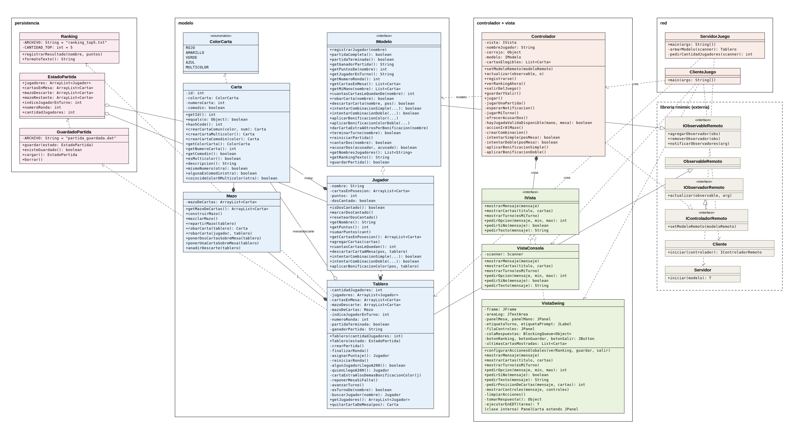

# DOS

Implementación en Java del juego de cartas **DOS** (de la familia del UNO) para la
materia Programación Orientada a Objetos — juego en red (cliente/servidor con RMI),
MVC, Observer, persistencia y dos interfaces (consola y gráfica).

## El juego

Se juega de **2 a 4 jugadores**. Cada uno arranca con 7 cartas; hay una mesa
compartida (empieza con 2 cartas) y un mazo para robar. El objetivo de cada
ronda es quedarte sin cartas en la mano combinándolas contra las de la mesa.
La partida se juega a rondas hasta que alguien llega a **200 puntos**.

Las cartas son de 4 colores (rojo, amarillo, verde, azul) con números del 1
al 10, más comodines (número 0) y cartas multicolor (número 2).

## Reglas de nuestra implementación

**En tu turno**, elegís entre:
- **Robar** una carta del mazo. Si la jugás, pasás directo a combinar; si no,
  te descartás de una carta a la mesa.
- **Combinar**, contra las cartas que había en la mesa *al empezar tu turno*
  (una carta que se agrega a la mesa durante tu propio turno no se puede usar
  hasta el turno siguiente). Si no tenés ninguna combinación posible, la
  opción de combinar no aparece — hay que robar sí o sí.

**Combinación simple**: una carta tuya contra una de la mesa, mismo número
(o comodín). Si además coinciden en color (o alguna es multicolor), sumás
**bonificación de color**: mandás otra carta tuya a la fila central.

**Combinación doble**: dos cartas tuyas contra una de la mesa, cuya suma
cierra según las reglas de comodín. Con bonificación de color acá, además de
mandar una carta a la fila central, **todos los demás jugadores levantan una
carta del mazo** — pase lo que pase, aunque a vos no te quede ninguna carta
para mandar a la mesa.

La mesa se repone del mazo solo cuando queda por debajo de 2 cartas, no
después de cada combinación.

**¡DOS!**: si te quedan exactamente 2 cartas, podés cantarlo. Si no lo
cantás, cualquier otro jugador puede acusarte en su turno — si tenía razón,
robás 2 cartas de penalización.

## Puntaje

Cuando alguien se queda sin cartas, gana la ronda y suma los puntos de lo
que le quedó en la mano a los demás jugadores:

| Carta | Puntos |
|---|---|
| Comodín (número 0) | 40 |
| Multicolor (número 2) | 20 |
| Cualquier otra | su propio número |

La partida termina cuando alguien llega a 200 puntos acumulados. Al
terminar, se guarda el resultado en un ranking Top 5 persistente.

## Arquitectura

- **Modelo** (`Tablero`, único y remoto, corre en el servidor) — implementa
  `IModelo` y extiende `ObservableRemoto` de la librería
  [rmimvc](https://github.com/federicoradeljak/libreria-rmimvc), que provee
  el patrón Observer y el soporte de RMI.
- **Vista + Controlador**: uno por cliente, corren en el proceso de cada
  jugador. `IVista` tiene dos implementaciones intercambiables —
  `VistaConsola` y `VistaSwing` — sin que el Modelo ni el Controlador
  cambien una línea entre una y otra.
- **Persistencia**: ranking Top 5 (`Ranking`) y guardado/continuación de
  partida (`EstadoPartida` + `GuardadoPartida`), ambos con serialización de
  Java a archivo.

## Diagrama de clases

## Cómo correrlo

Primero hay que compilar una vez desde el IDE (Build > Build Project en
IntelliJ, o el equivalente en el tuyo) para que se genere la carpeta `out/`
con las clases compiladas.

Con eso ya hecho, no hace falta abrir el IDE de nuevo para jugar — en la
raíz del repo hay scripts para arrancar todo con doble clic:

| Script | Para qué |
|---|---|
| `iniciar_servidor.bat` / `.sh` | Levanta el servidor (una sola vez por partida) |
| `iniciar_cliente.bat` / `.sh` | Un cliente por jugador — correrlo 2 a 4 veces |

Doble clic en `iniciar_servidor` primero, y después en `iniciar_cliente`
tantas veces como jugadores. Cada cliente pide la IP del servidor (Enter
para localhost), el nombre del jugador, y si quiere interfaz de consola o
gráfica.

Cada cliente pide la IP del servidor, el nombre del jugador, y si quiere
interfaz de consola o gráfica.
